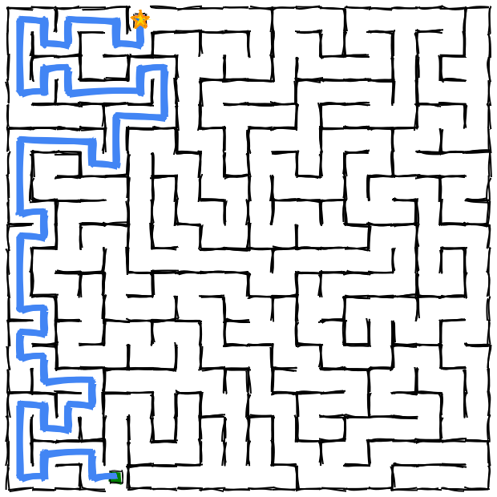

# Perfect Maze Generator

My Web Maze generates perfect mazes with a hand-drawn aesthetic. Users can customize dimensions, solve mazes by tracing paths, and download their creations in various formats. Features include adjustable cell sizes, hard mode with limited visibility, and performance tracking with a timer and star rating system.

**Try it online: [https://codeprimate.github.io/mywebmaze](https://codeprimate.github.io/mywebmaze)**



## Features

- Generate random mazes with customizable seeds
- Resize maze dimensions by dragging the bottom-right corner
- Adjust cell size using the mouse wheel or pinch gesture
- Trace the path from entrance to exit
- Download mazes as SVG or PNG
- Create PDF with multiple mazes on a single page
- Hard mode that limits visibility while solving
- Timer and star rating system to track your performance
- Responsive design for various screen sizes
- Hand-drawn aesthetic using Rough.js

[](https://claude.ai) 

## How to Use

1. **Generate a Maze**: Enter a seed number or click the reload button to create a new random maze
2. **Adjust Cell Size**: Use your mouse wheel (on computer) or pinch gesture (on phone) to make cells larger or smaller
3. **Resize the Maze**: Drag the bottom-right corner to change dimensions
4. **Trace the Path**: Click and drag to trace the path from entrance to exit 
5. **Hard Mode**: Toggle "Hard Mode" to only see part of the maze while solving for an extra challenge
6. **Track Performance**: Use the timer and star rating system to measure your solving skills
7. **Download**: Save your maze as an SVG or PNG file using the download buttons
8. **Multiple Mazes**: Create a PDF with multiple mazes on a single page using the "Multiple Mazes" button
9. **Reset Path**: Clear your traced path with the reset button to try again
10. **Share Mazes**: Bookmark or share the URL of any maze - the seed number in the URL (e.g., #12345) creates the exact same maze every time

## Implementation

The maze is generated using a combination of advanced algorithms:

- **Enhanced Depth-First Search**: The core algorithm uses a modified DFS with directional persistence to create more natural flow patterns.
- **Strategic Wall Removal**: Selectively removes walls to create loops while maintaining puzzle integrity and difficulty.
- **Optimization Engine**: A multi-generation system that creates multiple candidate mazes with varying parameters and selects the most challenging one.
- **Difficulty Scoring**: Analyzes maze complexity using factors including branch points, false paths, solution length, and decision point density.

The maze generation system ensures:
- Balanced complexity with customizable difficulty levels
- Variable dead-end length for more engaging puzzles
- High-quality mazes that provide appropriate challenge for solvers
- Proper entrance and exit placement with guaranteed solution path

## Dependencies

- [Rough.js](https://roughjs.com/) - Library used for the hand-drawn aesthetic (MIT License)
- [jsPDF](https://github.com/parallax/jsPDF) - Library used for PDF generation (MIT License)
- [Nanum Pen Script](https://fonts.google.com/specimen/Nanum+Pen+Script) - Google Font used for the handwritten text style (SIL Open Font License). The font is bundled with this project for offline use. See the included OFL.txt file for the full license text.

## Installation

Simply clone this repository and open `index.html` in a web browser:

```
git clone https://github.com/codeprimate/mywebmaze.git
cd mywebmaze
open index.html
# Create a bookmark in your web browser for convenience

Alternatively, you can access the maze generator online at:
https://codeprimate.github.io/mywebmaze

No installation required when using the online version.

## URL Parameters

- Add `#12345` to the URL to generate a specific maze seed
- Add `?debug` after the seed to enable debug mode

## License

Copyright © 2025 codeprimate. MIT license.

Permission is hereby granted, free of charge, to any person obtaining a copy of this software and associated documentation files (the "Software"), to deal in the Software without restriction, including without limitation the rights to use, copy, modify, merge, publish, distribute, sublicense, and/or sell copies of the Software, and to permit persons to whom the Software is furnished to do so, subject to the following conditions:

The above copyright notice and this permission notice shall be included in all copies or substantial portions of the Software.

THE SOFTWARE IS PROVIDED "AS IS", WITHOUT WARRANTY OF ANY KIND, EXPRESS OR IMPLIED, INCLUDING BUT NOT LIMITED TO THE WARRANTIES OF MERCHANTABILITY, FITNESS FOR A PARTICULAR PURPOSE AND NONINFRINGEMENT. IN NO EVENT SHALL THE AUTHORS OR COPYRIGHT HOLDERS BE LIABLE FOR ANY CLAIM, DAMAGES OR OTHER LIABILITY, WHETHER IN AN ACTION OF CONTRACT, TORT OR OTHERWISE, ARISING FROM, OUT OF OR IN CONNECTION WITH THE SOFTWARE OR THE USE OR OTHER DEALINGS IN THE SOFTWARE. 