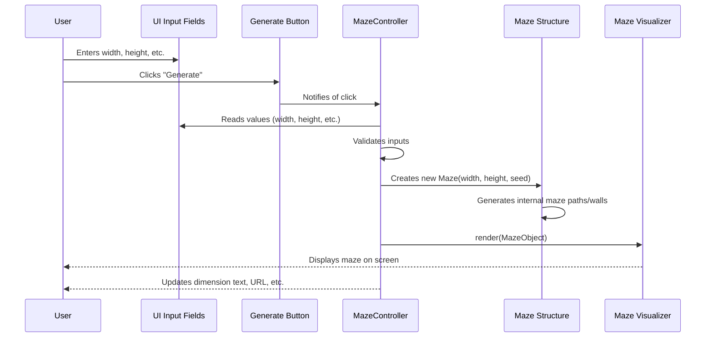

# Chapter 1: UI Control Panel

Welcome to your first step in understanding `mazegen`! This project is all about creating and exploring mazes, and to do that, you first need a way to tell the "maze-making machine" what kind of maze you want. That's where the **UI Control Panel** comes in.

## What's the Big Idea? The UI Control Panel

Imagine you're about to bake a cake. You'd need to decide on the size of the cake, maybe its shape, and what ingredients to use. The UI Control Panel in `mazegen` is like your recipe card and the control knobs on your oven. It’s the place where you, the user, make all these decisions for your maze.

**Use Case:** Let's say you want to create a small, simple maze that's 10 cells wide and 10 cells tall. You'd use the UI Control Panel to tell `mazegen` these dimensions, and then with a click of a button, your maze appears!

The UI Control Panel is the central hub for all your interactions. It:

1.  Lets you **input** settings for the maze (like its width and height).
2.  **Listens** for when you click the "Generate" button.
3.  **Orchestrates** the creation of a new maze based on your settings.
4.  **Updates** the screen to show you the new maze.
5.  Manages other helpful UI bits like download buttons and information displays.

Think of it as the dashboard of your very own maze-making machine!

## Meet Your Maze Controls (The Inputs)

The control panel has several input fields where you can specify what you want:

*   **Width:** This tells `mazegen` how many cells (or squares) wide your maze should be.
    *   *Example:* If you enter `10`, your maze will be 10 cells across.
*   **Height:** This tells `mazegen` how many cells tall your maze should be.
    *   *Example:* If you enter `15`, your maze will be 15 cells from top to bottom.
*   **Cell Size:** This determines how big each individual cell (and therefore the walls) will look on your screen, in pixels.
    *   *Example:* A `cellSize` of `20` means each little square in the maze grid will be 20 pixels by 20 pixels.
*   **Seed:** This is a special number. If you use the same width, height, and seed, you will always get the *exact same maze design*. If you change the seed (or let `mazegen` pick a random one), you'll get a different maze, even if the width and height are the same. It's like the unique "fingerprint" for a maze's layout.

You'll see these input fields on the webpage, probably looking something like this (conceptually):

```html
<!-- This is a simplified idea of what the HTML might look like -->
Width: <input type="number" id="width" value="20">
Height: <input type="number" id="height" value="20">
Cell Size: <input type="number" id="cellSize" value="20">
Seed: <input type="number" id="seed" value="12345">
<button id="generateBtn">Generate Maze</button>
```
These HTML elements are what you interact with. The JavaScript code, which we'll look at, reads values from these fields.

## Telling the Machine to Go! (The "Generate" Button)

Once you've set your desired width, height, cell size, and perhaps a specific seed, you hit the "Generate" button. This is where the magic starts!

When you click this button, the `MazeController` (a part of our UI Control Panel logic) wakes up. It's the brain behind the panel. It will:

1.  Read the values you entered in the input fields.
2.  Use these values to ask the core `mazegen` system to build a new [Maze Structure](02_maze_structure_.md).
3.  Then, it tells another part of the system, the [Maze Visualizer](05_maze_visualizer_.md), to draw this new maze on your screen.

## A Peek Under the Hood: How `MazeController` Works

The `MazeController` is found in the `js/maze-ui.js` file. Let's break down what it does when you want to generate a maze.

### Step 1: Listening for Your Commands

First, the `MazeController` needs to know when you click the "Generate" button or change an input. It does this by setting up "event listeners."

```javascript
// Inside js/maze-ui.js (simplified)
const MazeController = {
    setupEventListeners() {
        const generateBtn = document.getElementById('generateBtn');
        // ... other elements ...

        generateBtn.addEventListener('click', () => {
            // When generateBtn is clicked, do this:
            this.generateMaze(); // Call our main function
        });
        // ... listeners for other inputs like width, height ...
    }
    // ... other methods ...
};
```
This code snippet tells the browser: "Hey, when the HTML element with the ID `generateBtn` is clicked, run the `generateMaze` function."

### Step 2: Gathering Your Maze Specifications

When `generateMaze()` is called (either by clicking the button or changing an input that triggers regeneration), it first needs to get the values you typed in.

```javascript
// Inside MazeController in js/maze-ui.js (simplified)
generateMaze() {
    const widthInput = document.getElementById('width');
    const heightInput = document.getElementById('height');
    // ... get cellSizeInput and seedInput too ...

    const width = parseInt(widthInput.value, 10);
    const height = parseInt(heightInput.value, 10);
    // ... get cellSize and seed values ...
    // Now 'width' and 'height' hold the numbers you entered.
}
```
This part finds the input fields in the HTML and reads their current `value`. `parseInt` is used to make sure we're treating the text from the input field as a number.

### Step 3: Making Sure Your Inputs Make Sense (Validation)

What if you accidentally type "abc" for width, or a huge number like 9999? The `MazeController` checks this.

```javascript
// Inside MazeController (simplified)
isValidInput(value, min, max) {
    // Checks if value is a number and within min/max range
    return !isNaN(value) && value >= min && value <= max;
}

generateMaze() {
    // ... (get inputs as before) ...
    const width = parseInt(widthInput.value, 10);
    const height = parseInt(heightInput.value, 10);

    // If input is invalid, use a default value
    const validWidth = this.isValidInput(width, 5, 100) ? width : 20;
    const validHeight = this.isValidInput(height, 5, 100) ? height : 20;
    // ... validate cellSize and seed ...
}
```
The `isValidInput` helper function checks if the number is within a reasonable range (e.g., width between 5 and 100). If not, `generateMaze` will use sensible default values.

### Step 4: Creating the Maze

With valid numbers for width, height, cell size, and seed, the `MazeController` is ready to tell the main maze logic to get to work.

```javascript
// Inside MazeController.generateMaze() (simplified)
generateMaze() {
    // ... (get and validate inputs as before) ...
    const validWidth = /* ... */;
    const validHeight = /* ... */;
    const validCellSize = /* ... */;
    const validSeed = /* ... */;

    // Create a new Maze object (more in Chapter 2 & 4)
    _maze = new MazeApp.Maze(validWidth, validHeight, validCellSize, validSeed);
    _maze.generate(); // Tell the maze to create its paths and walls
}
```
Here, `new MazeApp.Maze(...)` creates an instance of our [Maze Structure](02_maze_structure_.md). Then, `_maze.generate()` kicks off the actual [Maze Generation](04_maze_generation_.md) algorithm. The `_maze` variable will hold our newly created maze data.

### Step 5: Showing You the Maze

Once the maze is generated in memory, we need to see it! The `MazeController` uses a [Maze Visualizer](05_maze_visualizer_.md) (which we call `_mazeRenderer` here) to draw it.

```javascript
// Inside MazeController.generateMaze() (simplified)
generateMaze() {
    // ... (create and generate _maze as before) ...

    _mazeRenderer.render(_maze); // Draw the maze on the screen

    // Update text display for dimensions
    const dimensionsElement = document.getElementById('dimensions');
    if (dimensionsElement) {
        dimensionsElement.textContent = `${validCellSize} × (${validWidth}×${validHeight})`;
    }
}
```
The `_mazeRenderer.render(_maze)` command takes the generated maze data and draws all the walls and paths on the screen. It also updates a little display that shows the current dimensions.

### Step 6: Extra Goodies

The `MazeController` also handles:

*   Updating the URL with the current seed, so you can share a link to a specific maze.
*   Showing or hiding a "Download Full Sheet" button based on the maze size.
*   Making the seed input field resize dynamically based on its content.
*   Handling clicks on download buttons (SVG, PNG).

### Visualizing the Flow

Here's a simplified diagram of what happens when you click "Generate":



## Other Controls Handled by the Panel

Besides the core generation settings, the UI Control Panel, through the `MazeController`, also manages:

*   **Download Buttons:** Buttons like "Download SVG", "Download PNG", and "Download Full Sheet" are wired up by the `MazeController`. When you click them, specific functions (`downloadMaze`, `downloadPng`, `downloadFullSheet`) are called to prepare and trigger the download of the maze image or a PDF sheet of mazes.
*   **Dimension Readouts:** A small text area often displays the current maze's dimensions (e.g., "20x20 cells, 15px cell size"). The `MazeController` updates this whenever a new maze is generated.
*   **Difficulty Score:** It can also display a [Difficulty Judge's](03_difficulty_judge_.md) assessment of the current maze.

These features make the `mazegen` tool more user-friendly and powerful, all orchestrated by our trusty UI Control Panel.

## What We've Learned

Phew! That was a quick tour of the UI Control Panel. You've learned:
*   It's your main way to tell `mazegen` what kind of maze to create.
*   It uses input fields for width, height, cell size, and seed.
*   The `MazeController` is the JavaScript brain that listens to your inputs, validates them, and coordinates the maze creation and display process.
*   It interacts with other key parts of `mazegen` like the [Maze Structure](02_maze_structure_.md), [Maze Generation](04_maze_generation_.md) logic, and the [Maze Visualizer](05_maze_visualizer_.md).

The UI Control Panel is like the captain of the ship, taking your orders and making sure everyone else does their part to bring your maze to life!

## Next Steps

Now that you understand how you *tell* `mazegen` what to do, let's dive into what a maze actually *is* from the program's perspective. In the next chapter, we'll explore the [Maze Structure](02_maze_structure_.md).

---

Generated by [AI Codebase Knowledge Builder](https://github.com/The-Pocket/Tutorial-Codebase-Knowledge)