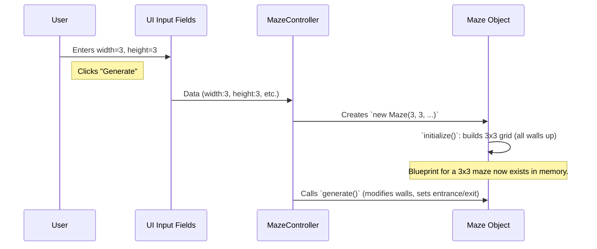

# Chapter 2: Maze Structure

In [Chapter 1: UI Control Panel](01_ui_control_panel_.md), you learned how to tell `mazegen` what kind of maze you want using settings like width, height, and seed. But once you click "Generate," what does `mazegen` actually create in its memory to represent your maze? That's where the **Maze Structure** comes in!

## What's the Big Idea? The Maze Structure

Imagine you're an architect. Before a building is constructed, you need detailed blueprints. These blueprints show every room, every wall, every doorway, and where the main entrance and exits are. The **Maze Structure** in `mazegen` is exactly like that blueprint for our mazes.

It's the digital plan that defines:

*   A **grid** of individual cells (the "rooms" and "corridors" of our maze).
*   The **state of walls** for each cell: Is there a wall to the north, east, south, or west?
*   The specific locations of the **entrance** and **exit** points.
*   It also keeps track of information about any **path you might draw** while solving the maze.

**Use Case:** Let's say you used the UI Control Panel to request a 5 cells wide by 5 cells tall maze. `mazegen` doesn't just splash pixels on the screen immediately. First, it builds a `Maze Structure` in its memory. This structure is a precise, organized description of that 5x5 grid, knowing where every potential wall is, even before the actual maze paths are carved out.

This `Maze Structure` is the core data model representing a single maze. Everything else in `mazegen`—like generating the paths or drawing the maze—works *with* this structure.

## The Building Blocks of a Maze Structure

Let's break down what makes up this digital blueprint.

### 1. The Grid: A City of Cells

Think of a chessboard or a sheet of graph paper. A maze is fundamentally a grid. This grid is made up of rows and columns of individual **cells**.

*   If your maze is `width: 10` and `height: 8`, the grid will have 10 columns and 8 rows, meaning a total of 80 cells.

### 2. Cells: The Individual Squares

Each cell in the grid is an object that knows a few things about itself:

*   **Its Location:** Every cell knows its `row` and `column` number within the grid. For example, the cell at the very top-left corner could be `row: 0, col: 0`.
*   **Its Walls:** This is crucial! Each cell has four potential walls: `north`, `east`, `south`, and `west`. The Maze Structure stores whether each of these walls is `true` (the wall exists) or `false` (the wall has been removed, creating a passage).
    *   Initially, when the grid is first set up, all cells have all their walls intact.
*   **Visited State:** During the process of [Maze Generation](04_maze_generation_.md) (which we'll cover later), the system needs to keep track of which cells it has already processed. Each cell has a `visited` property for this.

Here's a conceptual peek at what a single cell's data might look like (simplified):

```javascript
// This isn't exact code you type, but how a cell is represented
let oneCell = {
    row: 2,
    col: 3,
    visited: false, // Has the maze generator visited this cell yet?
    walls: {
        north: true,  // Wall to the north is up
        east: true,   // Wall to the east is up
        south: false, // Wall to the south is GONE (a passage!)
        west: true    // Wall to the west is up
    }
};
```

### 3. Entrance and Exit: Getting In and Out

A maze isn't much fun without a way in and a way out! The Maze Structure stores the specific coordinates (row and column) of the **entrance cell** and the **exit cell**. It also knows which wall of these cells is opened up to form the actual entrance/exit.

### 4. User's Path Information: Tracking Your Progress

When you start drawing your solution path on the maze, the Maze Structure also holds information about this:
*   The sequence of cells in your current path (`userPath`).
*   Whether you've successfully reached the exit (`isCompleted`).
*   The current end-point of your drawn path (`currentPathEnd`).
This information is used by the [Interactive Path Navigator](06_interactive_path_navigator_.md).

## Creating the Blueprint: The `Maze` Object

In `mazegen`, the Maze Structure is represented by an object created from the `Maze` class (found in `js/maze-core.js`). When the [UI Control Panel](01_ui_control_panel_.md) gets your settings (e.g., width, height, seed), it asks for a new `Maze` object to be made.

```javascript
// From MazeController in js/maze-ui.js (simplified)
// User inputs: validWidth, validHeight, validCellSize, validSeed

// Create a new Maze object (our Maze Structure)
_maze = new MazeApp.Maze(validWidth, validHeight, validCellSize, validSeed);
```
This line tells `mazegen`: "Create a new blueprint for a maze with these dimensions, visual cell size, and starting seed."

Let's look at what happens inside the `Maze` object when it's born.

### Step 1: The Constructor - Birth of a Maze Blueprint

The `constructor` is a special function that runs when `new MazeApp.Maze(...)` is called. It takes the `width`, `height`, `cellSize`, and `seed` you provided.

```javascript
// Simplified from js/maze-core.js (inside the Maze class)
constructor(width, height, cellSize, seed) {
    this.width = width;         // How many cells wide
    this.height = height;       // How many cells tall
    this.cellSize = cellSize;   // For drawing later
    this.seed = seed;           // For repeatable randomness
    this.grid = [];             // An empty list, soon to hold cell rows
    // ... other properties like userPath initialized ...

    this.initialize(); // Call another method to set up the grid
}
```
This code stores the basic properties and then immediately calls `this.initialize()` to build the actual grid of cells.

### Step 2: `initialize()` - Laying Out the Grid

The `initialize` method builds the 2D array representing the grid. It loops through each row and column.

```javascript
// Simplified from js/maze-core.js (inside the Maze class)
initialize() {
    this.grid = []; // Start with an empty grid
    for (let r = 0; r < this.height; r++) { // For each row...
        const rowCells = []; // Create a new array for this row's cells
        for (let c = 0; c < this.width; c++) { // For each column in this row...
            // Create a cell for this (r,c) position and add it
            rowCells.push(this.createCell(r, c));
        }
        this.grid.push(rowCells); // Add the complete row of cells to the grid
    }
}
```
Imagine this building your graph paper, square by square. For each square, it calls `createCell`.

### Step 3: `createCell()` - Defining Each Square

The `createCell` method defines what each individual cell in our grid looks like initially.

```javascript
// Simplified from js/maze-core.js (inside the Maze class)
createCell(row, col) {
    return {
        row: row,         // Its row number
        col: col,         // Its column number
        visited: false,   // Not visited yet by maze generator
        walls: {          // All walls are initially UP (true)
            north: true,
            east: true,
            south: true,
            west: true
        },
        inPath: false // Not part of the user's drawn path yet
        // ... other path-related properties ...
    };
}
```
Notice that every cell starts with all its `walls` set to `true`. At this stage, our Maze Structure is like a grid of sealed boxes. No paths, no entrance, no exit yet!

## Visualizing the Initial Structure

Imagine we created a tiny 2x2 maze: `new MazeApp.Maze(2, 2, 20, 123)`.
After the `constructor` and `initialize` methods run, our `_maze.grid` would conceptually look like this:

*   `_maze.grid[0][0]`: A cell at (row 0, col 0) with all 4 walls up.
*   `_maze.grid[0][1]`: A cell at (row 0, col 1) with all 4 walls up.
*   `_maze.grid[1][0]`: A cell at (row 1, col 0) with all 4 walls up.
*   `_maze.grid[1][1]`: A cell at (row 1, col 1) with all 4 walls up.

And `_maze.entrance` and `_maze.exit` would be `null` (not yet defined).

```mermaid
graph TD
    subgraph Maze Grid (2x2)
        C00["Cell (0,0)<br/>N:T, E:T, S:T, W:T"]
        C01["Cell (0,1)<br/>N:T, E:T, S:T, W:T"]
        C10["Cell (1,0)<br/>N:T, E:T, S:T, W:T"]
        C11["Cell (1,1)<br/>N:T, E:T, S:T, W:T"]
    end
    Maze_Object["Maze Object<br/>(width:2, height:2)"] --> Maze Grid
    Maze_Object --> Entrance["Entrance: null"]
    Maze_Object --> Exit["Exit: null"]
```
*(T = True, meaning wall is present)*

## Carving the Paths: The Next Step (A Sneak Peek)

So, we have a blueprint of a grid with all walls up. How does it become a solvable maze?

This is where the [Maze Generation](04_maze_generation_.md) algorithms come in (Chapter 4). After the `Maze` object (our Maze Structure) is created and initialized, the `MazeController` calls its `generate()` method:

```javascript
// Inside MazeController.generateMaze() (simplified)
// _maze is our newly created Maze Structure
_maze.generate(); // Tell the maze to create its paths and walls!
```
The `_maze.generate()` method is responsible for:

1.  Running an algorithm (like Depth-First Search) to "walk" through the grid.
2.  **Modifying the Maze Structure:** It changes the `walls` properties of cells (e.g., `cell.walls.north = false;`) to create paths.
3.  Defining and storing the `this.entrance` and `this.exit` cell locations and openings.

So, the Maze Structure is first built as a "blank slate" grid, and then the generation process sculpts it into an actual maze.

## How It All Fits Together (Simplified)

Here's a simplified flow of how the Maze Structure is created based on your input:


This chapter focuses on that moment *after* `initialize()` but *before* `generate()` fully completes its path-carving. The structure is the container ready to be shaped.

## What We've Learned

You've now peeked "under the hood" to see the `Maze Structure`:
*   It's the **digital blueprint** of a maze, like an architect's plans.
*   It's primarily a **grid of cells**.
*   Each cell knows its **location** and the state of its four **walls** (up or down).
*   It stores the **entrance** and **exit** locations (after generation).
*   It's created as an instance of the `Maze` class, which initializes a grid with all walls up.
*   The [Maze Generation](04_maze_generation_.md) process then modifies this structure to carve out paths.
*   It also holds data for tracking the **user's drawn path**, which the [Interactive Path Navigator](06_interactive_path_navigator_.md) uses.

The Maze Structure is the fundamental data that `mazegen` works with. Without it, there'd be no maze to generate, visualize, or solve!

## Next Steps

Now that we have a way to represent a maze's structure, how do we know if the maze we've designed (or that the computer generated) is easy, medium, or hard? In the next chapter, we'll explore the [Difficulty Judge](03_difficulty_judge_.md), which analyzes our Maze Structure to give us a score!

---

Generated by [AI Codebase Knowledge Builder](https://github.com/The-Pocket/Tutorial-Codebase-Knowledge)