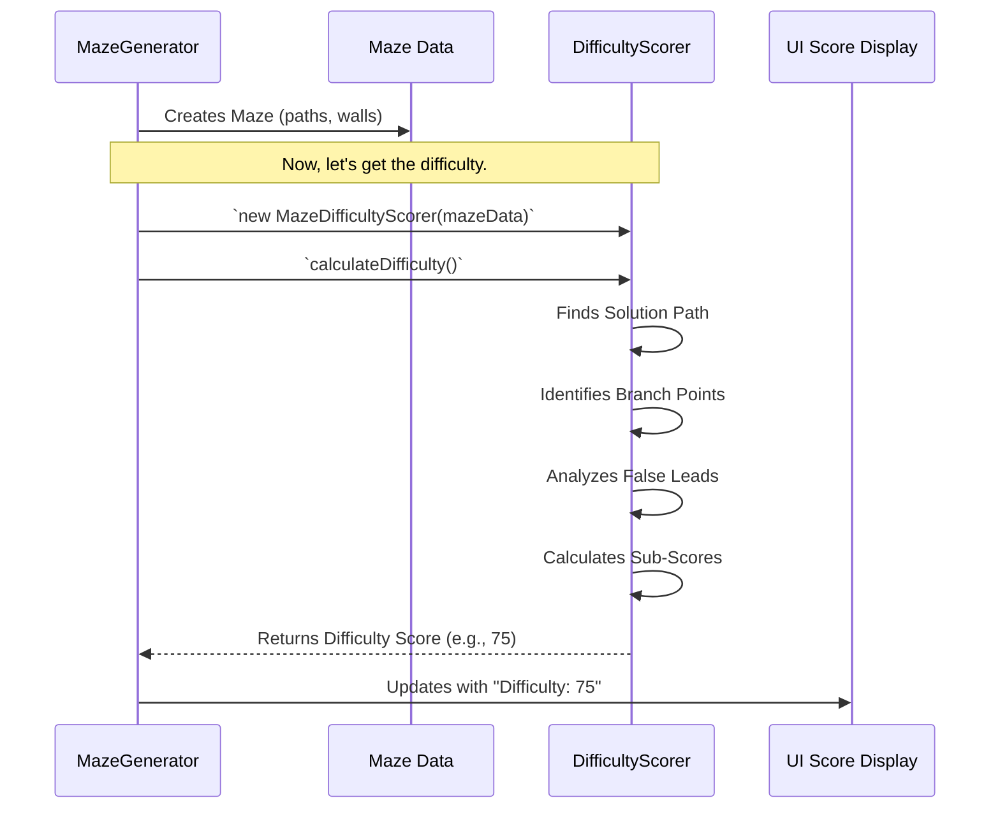

# Chapter 3: Difficulty Judge

In [Chapter 2: Maze Structure](02_maze_structure_.md), we learned how `mazegen` creates a digital blueprint for a maze, defining its grid, cells, and walls. But once we have this blueprint, how do we know if the resulting maze is a walk in the park or a brain-bending challenge? That's where the **Difficulty Judge** steps in!

## What's the Big Idea? The Difficulty Judge

Imagine you've just generated a maze. It looks cool, but is it easy, medium, or super tough? The Difficulty Judge is like an expert maze critic. It carefully examines the [Maze Structure](02_maze_structure_.md) and gives it a score, usually from 1 to 100, telling you how hard it thinks the maze will be to solve.

**Use Case:** After `mazegen` creates a maze, you might see a little piece of text like "Difficulty: 75/100". This score didn't just appear out of thin air! The Difficulty Judge analyzed the maze's design—things like how long the correct path is, how many misleading dead ends there are, and how many tricky decision points you'll encounter—to come up with that number.

This objective score helps you understand the challenge level of a maze without having to solve it yourself first. It's a quantifiable measure of toughness.

## How the Difficulty Judge "Thinks": Key Factors

The Difficulty Judge doesn't just guess. It considers several specific aspects of the maze's design:

1.  **Solution Path Length:**
    *   **What it is:** The length of the shortest path from the maze's entrance to its exit.
    *   **Why it matters:** Generally, a longer path means more steps to take, which can feel more challenging.
    *   **Analogy:** A short, direct route to a friend's house is easier than a long, winding one.

2.  **Branching Paths (False Leads):**
    *   **What it is:** Paths that lead away from the correct solution. These can be short dead ends or long, complex passages that ultimately go nowhere or loop back.
    *   **Why it matters:** Lots of convincing false leads can trick a solver and make the maze much harder.
    *   **Analogy:** Imagine navigating a city with many streets that look like main roads but are actually cul-de-sacs. The more of these you encounter, the trickier your journey.

3.  **Number and Complexity of Decision Points:**
    *   **What it is:** Places in the maze where you have to choose between two or more paths (e.g., a T-junction or a four-way intersection).
    *   **Why it matters:** Each decision point is a chance to make a wrong turn. More decision points, especially those with many options, increase complexity.
    *   **Analogy:** A hallway with one door is simple. A room with five identical doors is a tougher decision!

4.  **Distribution of Decision Points:**
    *   **What it is:** How these decision points are spread out along the solution path.
    *   **Why it matters:** A maze that saves all its tricky choices for the very end might feel different from one where difficult decisions are spread throughout. The Judge considers if tough spots are clustered or if they appear regularly.

The Difficulty Judge takes all these factors (and more!), weighs them, and combines them into that single numerical score.

## Using the Difficulty Judge

You don't typically click a "Judge Difficulty" button. Instead, the Difficulty Judge works behind the scenes. After a new [Maze Structure](02_maze_structure_.md) is generated, the system can automatically ask the Difficulty Judge to analyze it.

The [UI Control Panel](01_ui_control_panel_.md) might then display this score. It's part of the process of giving you feedback about the maze you've just created.



## A Peek Under the Hood: `MazeDifficultyScorer`

The logic for judging difficulty lives in a class called `MazeDifficultyScorer`, found in the `js/maze-difficulty-scorer.js` file. When a maze needs to be evaluated, an instance of this class is created, and it gets to work.

### Step 1: Birth of the Critic

First, a `MazeDifficultyScorer` object is created, and it's given the [Maze Structure](02_maze_structure_.md) (which we called `_maze` in previous chapters) that needs to be judged.

```javascript
// Simplified concept: How the scorer is created
// (This would happen after the _maze object is fully generated)
const mazeToJudge = _maze; // Our generated Maze Structure
const scorer = new MazeDifficultyScorer(mazeToJudge);
```
This `scorer` now has access to all the information about the maze's grid, walls, entrance, and exit.

### Step 2: The Main Calculation - `calculateDifficulty()`

The core job is done by the `calculateDifficulty()` method. This is the master function that orchestrates the entire analysis.

```javascript
// Inside js/maze-difficulty-scorer.js (very simplified)
class MazeDifficultyScorer {
    constructor(maze) {
        this.maze = maze; // Store the maze to analyze
        // ... other initializations ...
    }

    calculateDifficulty() {
        this.analyzeMaze(); // Step A: Understand the maze layout

        // Step B: Calculate scores for different aspects
        const branchScore = this.calculateBranchComplexityScore();
        const decisionScore = this.calculateDecisionPointScore();

        // Step C: Combine scores and apply adjustments
        let finalScore = (0.55 * branchScore) + (0.45 * decisionScore);
        // ... apply many other adjustments for size, path length etc. ...
        
        return Math.max(1, Math.min(100, Math.round(finalScore))); // Ensure 1-100
    }
    // ... other methods like analyzeMaze(), calculateBranchComplexityScore() ...
}
```
This looks simple here, but `analyzeMaze()`, `calculateBranchComplexityScore()`, and the adjustment calculations are where the detailed work happens. The numbers `0.55` and `0.45` are weights – they decide how much influence branch complexity versus decision points have on the final score. These weights are fine-tuned by the developer.

### Step 3: Analyzing the Maze - `analyzeMaze()`

Before scoring, the judge needs to understand the maze thoroughly. The `analyzeMaze()` method does this:

```javascript
// Inside js/maze-difficulty-scorer.js (simplified)
analyzeMaze() {
    this.findSolutionPath();       // Find the optimal path from start to end
    this.identifyBranchPoints();   // Find all decision points on that solution path
    this.analyzeAlternatePaths();  // Explore all the dead ends and false leads
}
```
*   **`findSolutionPath()`**: This is crucial. The scorer uses a pathfinding algorithm (like A*, which is clever like a GPS finding the best route) to discover the shortest correct path through the maze. This path becomes the baseline for judging other features.
*   **`identifyBranchPoints()`**: Once the solution path is known, this method looks at each cell along that path. If a cell on the solution path has an opening that leads *away* from the solution, it's marked as a "branching point" (a decision point).
*   **`analyzeAlternatePaths()`**: For every branching point found, this method explores those "alternate paths" (the false leads). It figures out how long they are, if they have their own sub-branches, if they are dead ends, etc.

### Step 4: Scoring the Components

With all that analysis done, the scorer can calculate individual scores for different aspects:

*   **`calculateBranchComplexityScore()`:**
    *   This looks at all the alternate paths (false leads).
    *   Longer false leads, false leads with many sub-branches, and those close to the exit generally get higher complexity scores.
    *   A maze with many complex, misleading branches will score higher here.

    ```javascript
    // Inside js/maze-difficulty-scorer.js (conceptual)
    calculateBranchComplexityScore() {
        let totalComplexity = 0;
        for (const branch of this.alternatePathsDetails) {
            // Factors: branch.length, branch.subBranches, branch.maxDepth, etc.
            // ... complex calculation for each branch ...
            totalComplexity += /* calculated complexity of this branch */;
        }
        // ... normalize and scale to a score (e.g., 0-100) ...
        return /* final branch complexity score */;
    }
    ```

*   **`calculateDecisionPointScore()`:**
    *   This considers the number of branching points found on the solution path.
    *   It also looks at how these decision points are distributed. A few very tricky decisions might be weighted differently than many simple ones.

    ```javascript
    // Inside js/maze-difficulty-scorer.js (conceptual)
    calculateDecisionPointScore() {
        const numDecisionPoints = this.branchingPoints.length;
        // ... consider distribution of these points ...
        let score = /* based on numDecisionPoints and their distribution */;
        // ... normalize and scale ...
        return /* final decision point score */;
    }
    ```

### Step 5: Adjustments and Final Score

The `calculateDifficulty()` method then takes these individual scores, applies various weights, and adds several "adjustment factors":

*   **Size Adjustment:** A huge maze with a simple path might still be easier than a tiny maze packed with tricks. This factor scales the difficulty based on the maze's overall dimensions (`width * height`).
*   **Solution Length Factor:** Adjusts the score based on how long the solution path is relative to the maze size.
*   **Absolute Path Adjustment:** Very short solution paths will reduce the difficulty significantly.
*   **False Path Density Factor:** Considers how many false paths there are and how much area they cover relative to the maze size.

After all calculations and adjustments, the score is clamped to be between 1 and 100. The `MazeDifficultyScorer` also has a feature to "compress" scores at the very high end, meaning it takes a *really* complex maze to get a score like 99 or 100. This helps provide better differentiation among typically difficult mazes.

The actual mathematical formulas inside the `MazeDifficultyScorer` can be quite intricate, involving square roots, ratios, and carefully chosen constants. These are the result of experimentation to make the scores feel "right" for a wide variety of mazes.

## What We've Learned

Phew! The Difficulty Judge is a pretty smart cookie. You've learned:

*   It objectively assesses a maze's complexity and assigns a numerical score (1-100).
*   It's like an expert maze critic, considering factors like solution path length, the number and complexity of branching paths (false leads), and the distribution of decision points.
*   The core logic is in the `MazeDifficultyScorer` class (`js/maze-difficulty-scorer.js`).
*   It works by first finding the solution path, then analyzing all the branches and decision points related to it.
*   Various factors are scored, weighted, and adjusted to produce the final difficulty rating.
*   This score helps users quickly understand how challenging a generated maze is likely to be.

The Difficulty Judge adds a fascinating layer of analysis to `mazegen`, turning a simple grid of paths and walls into something with a measurable "personality."

## Next Steps

We've seen how a maze is structured and how its difficulty is judged. But how are those paths and walls actually carved out of the initial grid in the first place? In the next chapter, we'll dive into the exciting world of [Maze Generation](04_maze_generation_.md) algorithms!

---

Generated by [AI Codebase Knowledge Builder](https://github.com/The-Pocket/Tutorial-Codebase-Knowledge)