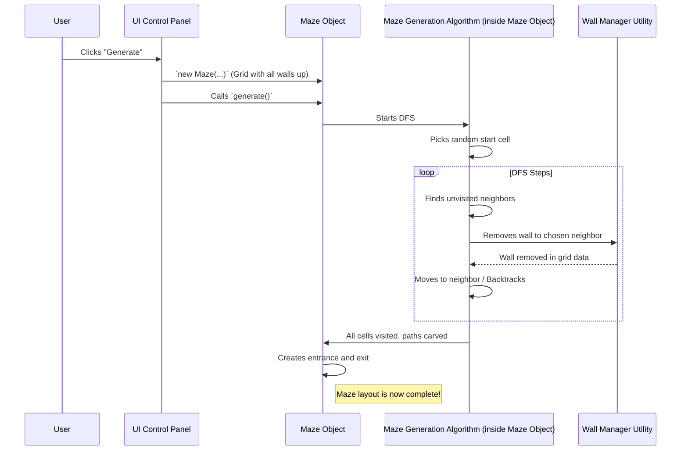

# Chapter 4: Maze Generation

In [Chapter 3: Difficulty Judge](03_difficulty_judge_.md), we saw how `mazegen` can analyze a completed maze blueprint and tell us how tricky it might be. But how does that blueprint, with all its paths and dead ends, get created in the first place? That's the magic of **Maze Generation**!

## What's the Big Idea? The Maze Architect

Imagine you have a solid block of stone (our initial grid of cells, where every cell is walled off from its neighbors, as we saw in [Chapter 2: Maze Structure](02_maze_structure_.md)). Maze Generation is like a sculptor who carefully carves tunnels and pathways into this block, turning it into an intricate maze.

The **Maze Generation** process is an algorithm—a set of step-by-step instructions—that starts with that solid grid and systematically removes walls between adjacent cells. `mazegen` uses a common technique called **Depth-First Search (DFS)** to do this. This smart approach ensures that every maze created is solvable, meaning there's always at least one path from an entrance to an exit. It also naturally creates all the fun stuff: winding corridors, tricky branches, and frustrating dead ends!

**Use Case:** You've used the [UI Control Panel](01_ui_control_panel_.md) to ask for a 20x20 maze. You click "Generate." What happens next? The Maze Generation algorithm kicks in. It takes the 20x20 [Maze Structure](02_maze_structure_.md) (which initially has all walls up) and starts "carving" paths until a complete maze layout is formed. It's like a specialized maze architect that designs a unique puzzle each time, especially if you use a different "seed" (a starting number for randomness).

## How the "Architect" Thinks: Depth-First Search (DFS)

So, how does this "Depth-First Search" architect work? Imagine you're exploring a dark, unexplored cave system (our grid) with a map and a piece of chalk:

1.  **Start Somewhere:** You pick a random spot in the cave (a random cell in the grid) and mark it as "visited" with your chalk. This is your current location.
2.  **Look Around:** From your current location, you look at all the adjacent spots (neighboring cells) that you haven't visited yet.
3.  **Choose a Path:**
    *   **If there are unvisited neighbors:** You randomly pick one of these unvisited neighbors. You then "break down the wall" between your current spot and this chosen neighbor. You move to this new spot, mark it as "visited," and add your *previous* spot to a "breadcrumb trail" (a list called a "stack") so you know how to get back. This new spot becomes your current location.
    *   **If there are NO unvisited neighbors:** You've hit a dead end from this spot! You need to backtrack. You look at your breadcrumb trail, go back to the *previous* spot you were in, and make *that* your current location.
4.  **Repeat:** You keep repeating steps 2 and 3. You either move forward into new territory or backtrack if you're stuck.
5.  **When to Stop:** You continue until you've backtracked all the way to your very first starting spot, and there are no more unvisited neighbors to explore from there. By this time, every cell in the grid will have been visited and connected to the maze!

This process naturally carves out a network of paths. Because you always connect to an existing part of the maze, you're guaranteed to have one connected structure.

### Visualizing the DFS Process (Simplified)

Imagine a tiny 2x2 grid. All walls are initially up.

1.  Start at Cell A (0,0). Mark A visited. Stack: [A]
2.  Neighbors of A: B (0,1) and C (1,0). Pick B randomly.
3.  Remove wall between A and B. Move to B. Mark B visited. Stack: [A, B]
4.  Neighbors of B: (A is visited), D (1,1). Pick D.
5.  Remove wall between B and D. Move to D. Mark D visited. Stack: [A, B, D]
6.  Neighbors of D: (B is visited), C (1,0). Pick C.
7.  Remove wall between D and C. Move to C. Mark C visited. Stack: [A, B, D, C]
8.  Neighbors of C: (A, D are visited). No unvisited neighbors. Backtrack. Pop C. Stack: [A, B, D]. Current: D.
9.  Neighbors of D: (B, C are visited). No unvisited. Backtrack. Pop D. Stack: [A, B]. Current: B.
10. Neighbors of B: (A, D are visited). No unvisited. Backtrack. Pop B. Stack: [A]. Current: A.
11. Neighbors of A: (B, C are visited). No unvisited. Backtrack. Pop A. Stack: [].
12. Stack is empty. Maze is generated!

The result is a maze where all cells are connected.

## Creating the Entrance and Exit

Once the main path network is carved, the Maze Generation process also needs to punch holes for an entrance and an exit. `mazegen` typically:
1.  Picks a random side of the maze (North, East, South, or West) for the entrance.
2.  Picks a random cell along that side (but not in a corner, to make it look nicer).
3.  Removes the outer wall of that cell to create the entrance.
4.  Does the same on the *opposite* side of the maze for the exit.

This ensures your maze has a clear start and finish.

## How It's Triggered

Remember from [Chapter 1: UI Control Panel](01_ui_control_panel_.md), when you click "Generate", the `MazeController` creates a `Maze` object (our [Maze Structure](02_maze_structure_.md)) and then calls its `generate()` method.

```javascript
// Inside MazeController.generateMaze() (simplified from js/maze-ui.js)
_maze = new MazeApp.Maze(validWidth, validHeight, validCellSize, validSeed);
_maze.generate(); // <<< THIS IS WHERE THE MAGIC HAPPENS!
```
The `_maze.generate()` method contains the logic for the Depth-First Search algorithm.



## A Peek Under the Hood: The `generate()` Method

The `generate()` method is part of the `Maze` class in `js/maze-core.js`. Let's look at simplified pieces.

### Step 1: Setting Up

```javascript
// Inside Maze class in js/maze-core.js (simplified)
generate() {
    // Start from a random cell using our seeded random number generator
    const startRow = this.randomInt(0, this.height - 1);
    const startCol = this.randomInt(0, this.width - 1);
    
    let currentCell = this.grid[startRow][startCol];
    currentCell.visited = true; // Mark as visited
    this.stack = [];           // Initialize our "breadcrumb trail"
    this.stack.push(currentCell); // Add start cell to the trail
    // ... rest of the algorithm ...
}
```
This picks a random starting cell using `this.randomInt` (which uses the `seed` you provided for predictable randomness if the seed is the same). It marks this cell `visited` and adds it to `this.stack`.

### Step 2: The Main Loop (DFS)

```javascript
// Inside Maze.generate() (continued)
    while (this.stack.length > 0) { // Keep going if breadcrumb trail isn't empty
        currentCell = this.stack[this.stack.length - 1]; // Get current cell from trail
        const neighbors = this.getUnvisitedNeighbors(currentCell);
        
        if (neighbors.length === 0) { // No unvisited neighbors?
            this.stack.pop(); // Backtrack! Remove current cell from trail
        } else {
            // Pick a random unvisited neighbor
            const { neighbor, direction } = neighbors[this.randomInt(0, neighbors.length - 1)];
            
            // Remove wall between currentCell and chosen neighbor
            MazeApp.WallManager.removeWalls(currentCell, neighbor, direction);
            
            neighbor.visited = true;    // Mark chosen neighbor as visited
            this.stack.push(neighbor);  // Add it to our trail
        }
    }
    // ... create entrance/exit and calculate difficulty ...
}
```
This is the heart of the DFS:
*   It loops as long as `this.stack` (our breadcrumb trail) has cells in it.
*   It gets `unvisitedNeighbors` for the `currentCell`.
*   If none, it `pop()`s from the stack (backtracks).
*   If there are neighbors, it picks one, calls `MazeApp.WallManager.removeWalls` to update the [Maze Structure](02_maze_structure_.md), marks the neighbor `visited`, and `push()`es it to the stack.

### Step 3: Finding Unvisited Neighbors

The `getUnvisitedNeighbors(cell)` method (also in `js/maze-core.js`) is a helper:

```javascript
// Inside Maze class (simplified)
getUnvisitedNeighbors(cell) {
    const neighbors = [];
    const { row, col } = cell;
    
    // Define potential directions to check
    const directions = [ /* N, E, S, W checks */ ]; 
    // Example for North: { dir: 'north', row: -1, col: 0 }
    
    directions.forEach(({ dir, row: dr, col: dc }) => {
        const newRow = row + dr;
        const newCol = col + dc;
        
        // Check if the neighbor is within grid and not visited
        if (/* newRow, newCol are valid AND grid[newRow][newCol] is not visited */) {
            neighbors.push({ neighbor: this.grid[newRow][newCol], direction: dir });
        }
    });
    return neighbors;
}
```
This method checks North, East, South, and West of the current `cell`. If a neighbor exists within the grid boundaries and hasn't been `visited` yet, it's added to a list.

### Step 4: Creating Entrance and Exit

After the main loop finishes, paths are carved. Then:

```javascript
// Inside Maze.generate() (continued, after the while loop)
    this.createEntranceAndExit();
    
    // Calculate difficulty score (as seen in Chapter 3)
    this.calculateDifficulty();
}

// Inside Maze class (simplified)
createEntranceAndExit() {
    // Pick random sides (e.g., north for entrance, south for exit)
    const entranceSide = /* ... random side ... */;
    const exitSide = /* ... opposite of entranceSide ... */;
    
    this.entrance = this.createOpening(entranceSide);
    this.exit = this.createOpening(exitSide);
}

createOpening(side) {
    let row, col;
    // ... logic to pick a row/col on that 'side' (not a corner) ...
    // ... for example, if side is 'north':
    // col = this.randomInt(1, this.width - 2); // Avoid corners
    // row = 0;
    // this.grid[row][col].walls.north = false; // Remove outer wall
    
    return { row, col, side }; // Store entrance/exit info
}
```
The `createEntranceAndExit()` method picks sides and calls `createOpening()` for each. `createOpening()` then chooses a specific cell on that side and sets its outer wall to `false`, effectively creating an opening in our [Maze Structure](02_maze_structure_.md).

Finally, `this.calculateDifficulty()` is called, which we learned about in [Chapter 3: Difficulty Judge](03_difficulty_judge_.md).

## The Role of the Seed

You might have noticed `this.randomInt` being used. This function uses a "seeded" random number generator. If you provide the same `seed` value (via the [UI Control Panel](01_ui_control_panel_.md)), `this.randomInt` will produce the *same sequence of random numbers* every time. This means it will make the same choices for starting cell, for picking neighbors, and for placing the entrance/exit. The result? The exact same maze layout! Change the seed, and you get a completely different maze.

## What We've Learned

You've now seen how `mazegen` acts like an architect to build mazes:

*   Maze generation is the process of algorithmically creating the maze's paths and walls.
*   It starts with a grid of cells where all walls are initially present.
*   `mazegen` uses a **Depth-First Search (DFS)** algorithm to carve paths by systematically removing walls.
*   This ensures a solvable maze with a single connected path structure, plus branches and dead ends.
*   The `generate()` method in the `Maze` class (from `js/maze-core.js`) implements this DFS logic.
*   It uses a stack for backtracking and randomly chooses paths among unvisited neighbors.
*   After path carving, it creates an entrance and an exit on opposite sides of the maze.
*   The **seed** value allows for reproducible maze designs.

The Maze Generation algorithm is the engine that breathes life into the static [Maze Structure](02_maze_structure_.md), turning a simple grid into a unique puzzle every time!

## Next Steps

We now have a fully generated maze in our program's memory, complete with paths, walls, an entrance, and an exit. But how do we actually *see* it on our screen? In the next chapter, we'll explore the [Maze Visualizer](05_maze_visualizer_.md), which takes this data and draws it for us!

---

Generated by [AI Codebase Knowledge Builder](https://github.com/The-Pocket/Tutorial-Codebase-Knowledge)