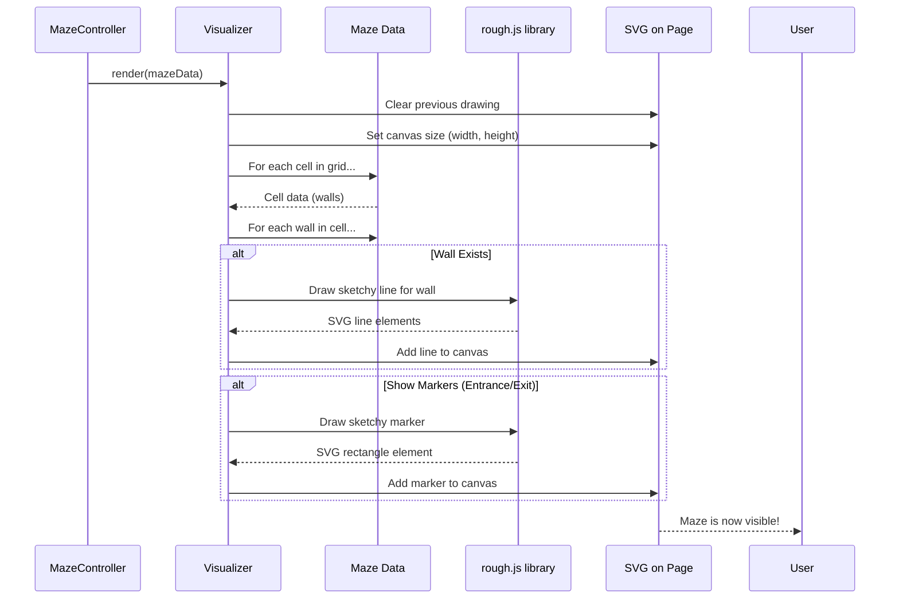

# Chapter 5: Maze Visualizer

In [Chapter 4: Maze Generation](04_maze_generation_.md), we saw how `mazegen` acts like an architect, using algorithms like Depth-First Search to design the intricate paths and walls of our maze. This process updates the [Maze Structure](02_maze_structure_.md) in the computer's memory. But a maze in memory isn't much fun if you can't see it! How do we take that abstract blueprint and actually draw it on your webpage? That's the job of the **Maze Visualizer**.

## What's the Big Idea? The Maze Artist

Imagine the [Maze Structure](02_maze_structure_.md) is a detailed blueprint of a maze. The **Maze Visualizer** is like a talented artist who takes this blueprint and sketches it onto a canvas (your webpage). This artist doesn't just draw plain, straight lines. Instead, they use a special style, making the maze look a bit "hand-drawn" or "sketchy."

**Use Case:** You've just clicked the "Generate" button on the [UI Control Panel](01_ui_control_panel_.md). The [Maze Generation](04_maze_generation_.md) process has created a new maze blueprint. Now, you want to see this maze on your screen! The Maze Visualizer steps in, reads the blueprint, and draws every wall, every corridor, and optionally marks the entrance and exit, all with a cool, sketchy look.

The Maze Visualizer's key tasks are:

1.  Taking the digital [Maze Structure](02_maze_structure_.md) as its input.
2.  Creating an **SVG (Scalable Vector Graphics)** image on the webpage. SVGs are great because they look sharp at any size.
3.  Drawing lines for all the **walls** that exist in the maze blueprint.
4.  Optionally, drawing small **markers** (like colored squares) to show the maze's entrance and exit.
5.  Using a JavaScript library called `rough.js` to give the drawing that distinct "hand-drawn" artistic style.

Think of it as your personal maze artist, ready to bring the digital blueprint to visual life!

## How the "Artist" Gets to Work

The Maze Visualizer doesn't decide *how* the maze is structured; that's the job of [Maze Generation](04_maze_generation_.md). It simply takes the finished [Maze Structure](02_maze_structure_.md) and draws what it's told.

After a maze is generated (as we saw in [Chapter 1: UI Control Panel](01_ui_control_panel_.md)), the `MazeController` tells the Maze Visualizer to do its thing:

```javascript
// Inside MazeController.generateMaze() (simplified from js/maze-ui.js)
// _maze is our generated Maze Structure
// _mazeRenderer is our Maze Visualizer

_mazeRenderer.render(_maze); // Tell the artist to draw this maze!
```
This one line, `_mazeRenderer.render(_maze)`, kicks off the entire drawing process.

## A Peek Under the Hood: The `MazeRenderer`

The logic for drawing the maze lives in a class called `MazeRenderer`, found within the `js/maze-core.js` file. Let's see how it works.

### Step 1: Setting up the Canvas and Tools

When the `MazeRenderer` is first created (usually when the application starts), it's given an SVG element from your HTML page. This SVG element is its "canvas." It also initializes `rough.js`, which is its special set of "sketching pens."

```javascript
// Inside js/maze-core.js (simplified - MazeRenderer constructor)
class MazeRenderer {
    constructor(svgElement) {
        // svgElement is the <svg> tag from our HTML page
        this.svgElement = svgElement;
        // Get the rough.js "artist" ready to draw on this SVG
        this.rough = rough.svg(svgElement);
    }
    // ... other methods ...
}
```
Now `this.rough` can be used to draw sketchy lines, rectangles, etc.

### Step 2: The `render(maze)` Method - Drawing Day!

This is the main method called to draw the maze. Here's a simplified flow of what happens:



Let's look at parts of the `render` method:

**Part A: Preparation**

```javascript
// Inside MazeRenderer.render(maze) in js/maze-core.js (simplified)
render(maze) {
    this.clear(); // Erase any old maze drawing

    // Calculate total drawing size including padding
    const totalWidth = maze.width * maze.cellSize + (padding * 2);
    const totalHeight = maze.height * maze.cellSize + (padding * 2);
    this.setSize(totalWidth, totalHeight); // Set the SVG canvas size

    // Draw a white background for the maze
    // ... (code to draw a white rectangle as background) ...
}
```
*   `this.clear()`: Wipes the SVG clean.
*   `this.setSize()`: Adjusts the SVG element's width and height to perfectly fit the new maze, including some `padding` around it.

**Part B: Drawing the Walls**

The visualizer then goes through every cell in the `maze.grid`.

```javascript
// Inside MazeRenderer.render(maze) (continued)
    for (let r = 0; r < maze.height; r++) { // For each row
        for (let c = 0; c < maze.width; c++) { // For each column
            const cell = maze.grid[r][c]; // Get the current cell

            // Check each of the four walls
            ['north', 'east', 'south', 'west'].forEach(direction => {
                if (cell.walls[direction]) { // Is this wall present?
                    // Yes! Let's draw it.
                    // 1. Get the wall's screen coordinates (x1,y1 to x2,y2)
                    const coords = WallManager.getWallCoordinates(cell, maze.cellSize, direction);

                    // 2. Tell rough.js to draw a sketchy line
                    const line = this.rough.line(
                        coords.x1, coords.y1, coords.x2, coords.y2,
                        { stroke: 'black', strokeWidth: 2, roughness: 1.5, seed: maze.seed + r + c }
                    );
                    this.svgElement.appendChild(line); // Add line to SVG
                }
            });
        }
    }
```
*   It loops through each `cell` in the `maze.grid`.
*   For each `cell`, it checks all four `cell.walls` (north, east, south, west).
*   If a wall exists (`cell.walls[direction]` is `true`), it gets the wall's pixel coordinates using `WallManager.getWallCoordinates()`. This helper function figures out where to draw the line on the screen based on cell size and position.
*   Then, `this.rough.line(x1, y1, x2, y2, options)` is called. This is `rough.js` in action! It doesn't draw a perfectly straight line, but a slightly wobbly, sketchy one.
    *   The `options` like `roughness: 1.5` control how sketchy it looks.
    *   Using the `maze.seed` helps make the sketchiness look the same if you regenerate the exact same maze.
*   The resulting `line` (which is an SVG element) is added to our main SVG canvas.

**Part C: Drawing Entrance and Exit Markers (Optional)**

If the "Show Markers" checkbox is ticked on the [UI Control Panel](01_ui_control_panel_.md), the visualizer also draws little colored squares for the entrance and exit.

```javascript
// Inside MazeRenderer.render(maze) (continued)
    const showMarkers = document.getElementById('showMarkers').checked;
    if (showMarkers) {
        this.drawMarker(maze, maze.entrance, 'green'); // Green for entrance
        this.drawMarker(maze, maze.exit, 'red');     // Red for exit
    }
}
```
This calls another helper method, `drawMarker`.

### Step 3: The `drawMarker()` Method

This method is responsible for drawing a single colored marker.

```javascript
// Inside MazeRenderer class in js/maze-core.js (simplified)
drawMarker(maze, position, color) {
    if (!position) return; // No position, nothing to draw

    // Calculate where to put the marker within the cell
    const x = position.col * maze.cellSize + padding + (maze.cellSize * 0.25);
    const y = position.row * maze.cellSize + padding + (maze.cellSize * 0.25);
    const markerSize = maze.cellSize * 0.5; // Make it half the cell size

    // Tell rough.js to draw a sketchy, filled rectangle
    const rect = this.rough.rectangle(
        x, y, markerSize, markerSize,
        { fill: color, fillStyle: 'solid', roughness: 1.2, seed: maze.seed + position.row }
    );
    this.svgElement.appendChild(rect); // Add marker to SVG
}
```
*   It calculates the `x`, `y` position and `markerSize`.
*   It then calls `this.rough.rectangle()` to draw a sketchy square.
    *   `fill: color` makes it green or red.
    *   `fillStyle: 'solid'` makes it a solid color (not just an outline).
*   This `rect` is also added to the SVG.

And that's it! The Maze Visualizer has taken the abstract [Maze Structure](02_maze_structure_.md) and, with the help of `rough.js`, created a beautiful, hand-drawn looking maze on your screen.

### The "Sketchy" Style from `rough.js`

The `rough.js` library is key to `mazegen`'s visual appeal. When we call `this.rough.line(...)` or `this.rough.rectangle(...)`, we can pass options that control the "sketchiness":

*   `stroke`: Color of the line.
*   `strokeWidth`: Thickness of the line.
*   `roughness`: How irregular or wobbly the line is. Higher numbers mean more roughness.
*   `bowing`: How much the lines curve or bow.
*   `seed`: A number that influences the random variations. Using the same seed (plus other unique values like cell coordinates) helps make the sketchiness consistent for a given maze element if it's redrawn.
*   `fill`: Color to fill a shape with.
*   `fillStyle`: Style of fill (e.g., `solid`, `hachure` for cross-hatching).

These options allow the "artist" to apply its distinct style.

## What We've Learned

You've now seen how `mazegen` turns a data structure into a picture:

*   The **Maze Visualizer** (or `MazeRenderer`) is responsible for drawing the maze.
*   It takes the [Maze Structure](02_maze_structure_.md) as input.
*   It draws onto an **SVG canvas** on the webpage.
*   It uses the **`rough.js` library** to give the maze a unique "hand-drawn" or "sketchy" look.
*   The main drawing happens in the `render()` method, which iterates through cells and draws walls.
*   It can also draw markers for the entrance and exit.
*   The visualizer is like an artist interpreting a blueprint with a specific style.

Without the Maze Visualizer, our `mazegen` project would just be a bunch of numbers and data in the computer's memory! It's this component that makes the mazes come alive visually.

## Next Steps

We have a maze, and we can see it! But what's a maze for if not to solve? In the next chapter, we'll explore the [Interactive Path Navigator](06_interactive_path_navigator_.md), which lets you, the user, try to find your way through the maze by drawing your path directly on the visualizer's output.

---

Generated by [AI Codebase Knowledge Builder](https://github.com/The-Pocket/Tutorial-Codebase-Knowledge)