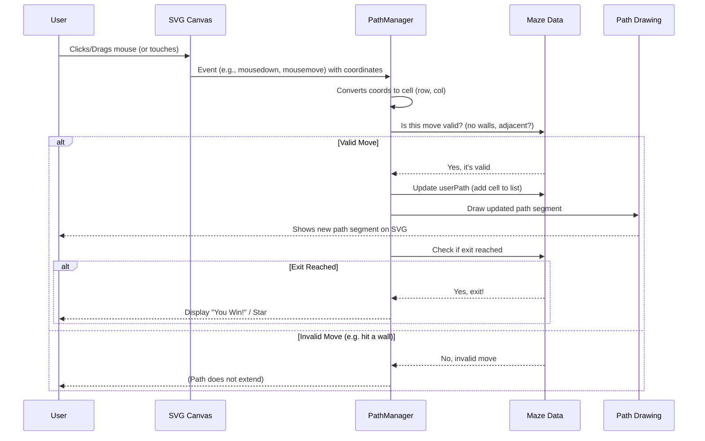

# Chapter 6: Interactive Path Navigator

Welcome back! In [Chapter 5: Maze Visualizer](05_maze_visualizer_.md), we learned how `mazegen` takes the digital blueprint of a maze and draws it on your screen with a cool, sketchy style. Now that we can *see* the maze, how do we actually *solve* it? That's where the **Interactive Path Navigator** comes into play!

## What's the Big Idea? Your Virtual Pen

Imagine you're given a printed maze and a pen. You'd start at the entrance and try to draw a line to the exit, right? The Interactive Path Navigator lets you do exactly that, but on the computer screen!

It's a system that:

1.  Lets you **use your mouse (or finger on a touch screen)** to draw a path directly on the maze image.
2.  **Tracks your movements** from one square (cell) of the maze to the next.
3.  **Checks if your moves are allowed** – you can't draw through walls!
4.  **Visually shows your drawn path**, also with a "hand-drawn" style.
5.  **Tells you when you've successfully reached the exit!**

**Use Case:** You've just generated a brand-new maze using the [UI Control Panel](01_ui_control_panel_.md). It appears on your screen thanks to the [Maze Visualizer](05_maze_visualizer_.md). Now, you want to solve it! You click (or tap) on the maze's entrance and start dragging your mouse (or finger) through the corridors. As you move, a colored line appears, tracing your route. If you try to go through a wall, the line won't extend. When your line reaches the exit, a "You Win!" message or a star might appear.

Think of it as giving you a virtual pen and making sure you follow the maze's rules as you draw.

## How It Works: Step-by-Step with Your Pen

Let's trace how the Interactive Path Navigator helps you solve the maze:

1.  **Listening for Your Touch (or Click):** The system constantly watches the maze image for mouse clicks or touch events.
2.  **Starting Your Journey:** When you first click/tap and start dragging from the maze's entrance, the navigator notes this as the beginning of your path.
3.  **Cell by Cell:** As you drag your mouse or finger, the navigator figures out which cell (square) of the maze your "pen" is currently over.
4.  **Checking the Rules:**
    *   Are you trying to move to an *adjacent* cell (not jumping across the maze)?
    *   Is there a *wall* between your current cell and the one you're trying to move to? The [Maze Structure](02_maze_structure_.md) knows where all the walls are.
    *   If the move is valid (adjacent, no wall), the navigator "accepts" it.
5.  **Drawing Your Trail:** If your move is valid, the system draws a line segment from your previous cell to the new one, extending your path. This line also uses the `rough.js` library for that sketchy, hand-drawn look.
6.  **Oops, a Wall!** If you try to drag through a wall, the navigator simply won't extend your path in that direction. Your drawn line stops at the last valid cell.
7.  **Reaching the Goal:** The navigator constantly checks if the end of your drawn path is on the maze's exit cell.
8.  **Victory!** If you reach the exit cell, the system recognizes you've solved the maze! It might show a congratulatory message or a special graphic (like a star).
9.  **Need to Restart?** There's usually a "Reset Path" button that lets you erase your current path and start over.

## The Brains Behind the Pen: The `PathManager`

In `mazegen`, the logic for all this interactive path drawing is handled by a component called the `PathManager`. It's typically found within the `js/maze-ui.js` file.

When a new maze is generated and drawn, a `PathManager` is also set up for it. It gets the current [Maze Structure](02_maze_structure_.md) (so it knows about walls, entrance, exit) and the SVG element where the maze is drawn (so it can listen for mouse/touch events and draw the path).

Here's a simplified idea of what happens when you try to draw a path:



## A Peek Under the Hood: How `PathManager` Draws

Let's look at some key parts of how the `PathManager` might work, simplified for clarity.

### Step 1: Setting Up and Listening

The `PathManager` needs to listen to your actions on the SVG canvas where the maze is drawn.

```javascript
// Inside PathManager in js/maze-ui.js (simplified)
class PathManager {
    constructor(maze, svgElement, roughInstance) {
        this.maze = maze; // The Maze Structure
        this.svgElement = svgElement; // The SVG drawing area
        this.rough = roughInstance; // For sketchy drawing
        // ... other initializations ...
        this.setupInteractions();
    }

    setupInteractions() {
        // Listen for mouse down (or touch start) on the SVG
        this.svgElement.addEventListener('mousedown', (event) => {
            this.handlePointerDown(event);
        });
        // Listen for mouse move (or touch move)
        this.svgElement.addEventListener('mousemove', (event) => {
            this.handlePointerMove(event);
        });
        // Listen for mouse up (or touch end)
        this.svgElement.addEventListener('mouseup', () => {
            this.isDrawing = false; // Stop drawing
        });
        // ... (similar listeners for touch events) ...
    }
}
```
*   The `constructor` gets the maze data, the SVG element, and a `rough.js` instance.
*   `setupInteractions` attaches "event listeners." These tell the browser: "When a mouse button is pressed down on the SVG, call `handlePointerDown`."

### Step 2: Starting or Continuing the Path (`handlePointerDown` and `handlePointerMove`)

When you click/tap or drag:

```javascript
// Inside PathManager (simplified)
handlePointerDown(event) {
    const cell = this.getCellFromEvent(event); // Figure out which cell was clicked
    if (!cell) return;

    if (this.maze.isCompleted) return; // Don't draw if already won

    // If path is empty, start it at the entrance cell
    if (this.maze.userPath.length === 0) {
        const entranceCell = this.maze.grid[this.maze.entrance.row][this.maze.entrance.col];
        this.addCellToPath(entranceCell); // Add entrance to our path list
    }
    this.isDrawing = true; // Now we are officially drawing
    this.lastCell = this.maze.userPath[this.maze.userPath.length - 1];
}

handlePointerMove(event) {
    if (!this.isDrawing) return; // Only do this if we're drawing

    const cell = this.getCellFromEvent(event); // Which cell are we over now?
    if (!cell || cell === this.lastCell) return; // No cell, or same cell as before

    if (this.addCellToPath(cell)) { // Try to add this cell
        this.lastCell = cell; // If successful, update lastCell
    }
}
```
*   `getCellFromEvent(event)`: This helper function (not shown in detail) converts the `x, y` pixel coordinates of your mouse/touch into `row, col` of a maze cell.
*   `handlePointerDown`: If it's the start of drawing, it ensures the path begins at the maze's entrance. It sets `this.isDrawing = true`.
*   `handlePointerMove`: If `isDrawing` is true, it gets the current cell. If it's a new cell, it tries to add it to the path using `addCellToPath`.

### Step 3: Is the Move Valid? (`addCellToPath` and `canAddCellToPath`)

The `addCellToPath` method is crucial. It first checks if the move is allowed using `canAddCellToPath`.

```javascript
// Inside PathManager (simplified)
addCellToPath(cell) {
    if (!this.canAddCellToPath(cell)) { // Check rules!
        return false; // Invalid move
    }

    // Valid move! Add to our path list
    this.maze.userPath.push(cell); // 'userPath' is in the Maze Structure
    this.maze.currentPathEnd = { row: cell.row, col: cell.col };

    this.renderPath(); // Redraw the path visually

    // Check for win
    if (cell.row === this.maze.exit.row && cell.col === this.maze.exit.col) {
        this.completeMaze();
    }
    return true;
}

canAddCellToPath(targetCell) {
    // Get the cell at the current end of our drawn path
    const currentEndCell = this.maze.grid[this.maze.currentPathEnd.row][this.maze.currentPathEnd.col];

    // Rule 1: Are they next to each other (adjacent)?
    if (!this.areCellsAdjacent(currentEndCell, targetCell)) {
        return false; // Not adjacent
    }

    // Rule 2: Is there a wall between them?
    // (This uses currentEndCell.walls and targetCell.walls from Maze Structure)
    if (this.hasWallBetween(currentEndCell, targetCell)) {
        return false; // Wall in the way!
    }
    return true; // All good!
}
```
*   `canAddCellToPath` uses helper functions (like `areCellsAdjacent` and `hasWallBetween`, not shown in detail) to check the [Maze Structure](02_maze_structure_.md) if the `targetCell` is reachable from the `currentEndCell` of your drawn path.
*   If `canAddCellToPath` returns `true`, then `addCellToPath` updates `this.maze.userPath` (a list of cells in your path, stored within the [Maze Structure](02_maze_structure_.md) object) and calls `renderPath()` to draw it.
*   It also checks if `targetCell` is the exit to call `completeMaze()`.

### Step 4: Drawing the Path Visually (`renderPath`)

This is similar to how the [Maze Visualizer](05_maze_visualizer_.md) draws walls, but for your path.

```javascript
// Inside PathManager (simplified)
renderPath() {
    this.clearPathGraphics(); // Erase old path drawing

    if (this.maze.userPath.length < 2) return; // Need at least 2 points for a line

    const pathPoints = this.getPathCenterPoints(); // Get [ {x,y}, {x,y}, ... ] coords

    // Draw the path line using rough.js
    const line = this.rough.line( // This is a simplified call
        pathPoints[0].x, pathPoints[0].y, // Start of segment
        pathPoints[pathPoints.length-1].x, pathPoints[pathPoints.length-1].y, // End of segment
        { stroke: '#4285F4', strokeWidth: 4, roughness: 1.8 }
    );
    // (Actual code draws segments between all points in pathPoints)
    this.maze.pathGroup.appendChild(line); // Add line to SVG

    // Highlight the end of the path (e.g., with a small circle)
    if (!this.maze.isCompleted) {
        this.highlightPathEnd();
    }
}
```
*   `clearPathGraphics()` removes any previously drawn path.
*   `getPathCenterPoints()` converts the list of cells in `this.maze.userPath` into a list of pixel coordinates (usually the center of each cell).
*   `this.rough.line(...)` is used to draw a sketchy line connecting these points. The color is often bright (like blue) to stand out.
*   `highlightPathEnd()` might draw a small circle at the current end of your path.

### Step 5: Victory! (`completeMaze`)

```javascript
// Inside PathManager (simplified)
completeMaze() {
    this.maze.isCompleted = true;
    this.renderCompletionStar(); // Draw a star or show a message
    // Potentially disable further drawing
}
```
*   Sets a flag `this.maze.isCompleted` to `true`.
*   Calls a function like `renderCompletionStar()` to draw a visual celebration, perhaps a golden star at the exit using `rough.js`.

### Step 6: Starting Over (`resetPath`)

The UI will have a "Reset Path" button. When clicked, it calls a method like this:

```javascript
// Inside PathManager (simplified)
resetPath() {
    this.maze.userPath = []; // Clear the list of cells in the path
    this.maze.isCompleted = false;
    this.maze.currentPathEnd = { /* ...reset to entrance... */ };
    this.clearPathGraphics(); // Erase the path from the SVG
    // Maybe redraw maze markers if they changed for 'completed' state
}
```
This clears the path data stored in the [Maze Structure](02_maze_structure_.md) and erases the visual path from the screen.

## Your Path, Your Style

Just like the maze walls, the path you draw with the Interactive Path Navigator also gets that nice, slightly wobbly "hand-drawn" look. This is thanks to `rough.js` being used by the `PathManager` when it draws the lines and markers for your path. It keeps the visual style consistent and fun!

## What We've Learned

You've now seen how `mazegen` lets you become an active maze-solver:

*   The **Interactive Path Navigator** allows you to draw your solution path directly on the maze.
*   It's managed by the `PathManager` component.
*   It listens for **mouse or touch inputs** on the SVG canvas.
*   It converts screen coordinates to **maze cells**.
*   It validates moves by checking against the [Maze Structure](02_maze_structure_.md) (no going through walls!).
*   It **visually renders** your path, typically with a sketchy blue line.
*   It detects when you **reach the exit** and signals a win.
*   You can usually **reset your path** to try again.

This feature makes `mazegen` much more engaging by turning a static picture into a playable game!

## Next Steps

We've covered a lot of ground, from how you tell `mazegen` what to build, to how the maze itself is structured, judged for difficulty, generated, drawn, and finally, how you can interact with it. What holds all these pieces together? In the final chapter, we'll look at the [Application Core & Dependency Loader](07_application_core___dependency_loader_.md), which is like the main program that starts everything up.

---

Generated by [AI Codebase Knowledge Builder](https://github.com/The-Pocket/Tutorial-Codebase-Knowledge)