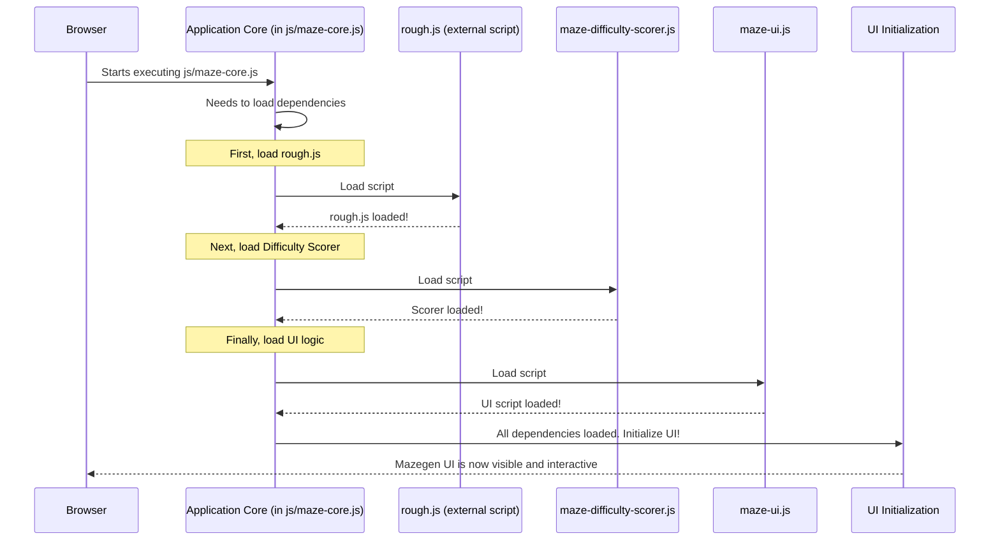

# Chapter 7: Application Core & Dependency Loader

Welcome to the final chapter of our `mazegen` journey! In [Chapter 6: Interactive Path Navigator](06_interactive_path_navigator_.md), we saw how you can draw your way through the mazes we create. But have you ever wondered how the entire `mazegen` application starts up? How does it make sure all its different parts, like the drawing tools and the UI buttons, are ready to go before you even see the first maze? That's the job of our **Application Core & Dependency Loader**.

## What's the Big Idea? The Engine Starter

Imagine your `mazegen` application is like a complex machine, say, a car. Before you can drive the car (interact with the maze), someone needs to:
1.  Make sure all essential parts are installed (like the engine, wheels, steering).
2.  Check if these parts are working.
3.  Turn the key to start the engine.

The **Application Core & Dependency Loader** is like the car's ignition system and the mechanic who does the initial setup. It's the very first piece of `mazegen` code that runs. Its main job is to get everything else ready.

**Use Case:** When you first open the `mazegen` webpage, nothing appears instantly. Behind the scenes, the Application Core is busy:

*   Loading essential external tools, like the `rough.js` library (which gives our mazes that cool sketchy look, as seen in the [Maze Visualizer](05_maze_visualizer_.md)).
*   Loading `mazegen`'s own internal modules, such as the [Difficulty Judge](03_difficulty_judge_.md) and the code for the [UI Control Panel](01_ui_control_panel_.md).
*   Crucially, it loads these in the *correct order*. For example, the UI code needs `rough.js` to be available *before* it can try to draw anything.
*   Once everything is loaded and ready, it gives the green light to initialize the user interface, making the controls and the first maze appear on your screen.

Think of it as the stage manager for a play, ensuring all actors, props, and lights are ready before the curtain rises.

## Key Components of the Starter System

Our `mazegen` startup system has a few key ideas:

1.  **The Conductor (`MazeApp`):** This is the central piece of code, found at the beginning of `js/maze-core.js`. It orchestrates the whole startup process.
2.  **The Script Loader:** A little helper function whose job is to fetch JavaScript files (our "dependencies") from their locations and add them to the webpage.
3.  **The Order of Operations:** The Conductor knows which scripts depend on others. For example, you can't use a special drawing tool (`rough.js`) if you haven't loaded it first! So, it loads scripts sequentially.
4.  **The "All Clear" Signal:** Once all necessary scripts are loaded, the Conductor kicks off the main application logic, like setting up the [UI Control Panel](01_ui_control_panel_.md).

## How It All Comes Together: The Startup Sequence

When your browser loads the `mazegen` HTML page, the `MazeApp` core (from `js/maze-core.js`) immediately starts its work.

Here's a simplified flow of what happens:



This careful, step-by-step loading ensures that when one part of the code tries to use another, the one it needs is already there and ready.

## A Peek Under the Hood: The `MazeApp` Startup Code

The main logic for this is within the `MazeApp` immediately-invoked function expression (IIFE) in `js/maze-core.js`. Let's look at simplified parts of it.

### 1. Declaring What's Needed (The `_dependencies` Object)

First, `MazeApp` keeps a list of scripts it needs to load.

```javascript
// Simplified from js/maze-core.js
const MazeApp = (function() {
    let _dependencies = {
        roughjs: {
            loaded: false,
            url: 'lib/rough.js' // Path to rough.js
        },
        difficultyScorer: {
            loaded: false,
            url: 'js/maze-difficulty-scorer.js'
        },
        ui: {
            loaded: false,
            url: 'js/maze-ui.js' // For the UI Control Panel
        }
    };
    // ... more code ...
})();
```
This object lists each dependency, its URL (where to find the file), and a `loaded` flag, initially `false`.

### 2. Fetching a Single Script (The `_loadScript` Function)

This helper function is responsible for creating a `<script>` tag in HTML to load a JavaScript file.

```javascript
// Simplified from js/maze-core.js
function _loadScript(url, callback) {
    const script = document.createElement('script');
    script.src = url;
    script.async = true; // Load without blocking other things

    script.onload = function() { // When successfully loaded
        console.log(`${url} loaded successfully`);
        if (callback) callback(); // Call next step
    };
    script.onerror = function() { // If loading fails
        console.error(`Failed to load ${url}`);
    };
    document.head.appendChild(script); // Add to page to start loading
}
```
When a script is loaded (`script.onload`), it calls a `callback` function. This `callback` is the key to loading the *next* script in sequence.

### 3. Loading in the Right Order (The `_loadDependencies` Function)

This function orchestrates the sequential loading.

```javascript
// Simplified from js/maze-core.js
function _loadDependencies(callbackAllDone) {
    // 1. Load rough.js
    _loadScript(_dependencies.roughjs.url, function() {
        _dependencies.roughjs.loaded = true;
        
        // 2. After rough.js, load difficulty scorer
        _loadScript(_dependencies.difficultyScorer.url, function() {
            _dependencies.difficultyScorer.loaded = true;
            
            // 3. After scorer, load UI script
            _loadScript(_dependencies.ui.url, function() {
                _dependencies.ui.loaded = true;
                if (callbackAllDone) callbackAllDone(); // All done!
            });
        });
    });
}
```
Notice the "nested" structure. The `callback` of the first `_loadScript` (for `rough.js`) contains the call to load the *second* script (`difficultyScorer.js`), and so on. This ensures `rough.js` loads, then `maze-difficulty-scorer.js` loads, then `maze-ui.js` loads. Only when the last one is done does it call `callbackAllDone`.

### 4. The Final Go-Ahead (The `_initializeApp` Function)

Once all dependencies are loaded, this function is called. It's responsible for starting the user-facing part of the application.

```javascript
// Simplified from js/maze-core.js
function _initializeApp() {
    // Check if the MazeUI module (from maze-ui.js) is now available
    if (typeof MazeUI !== 'undefined') {
        // Wait for the HTML document to be fully ready
        document.addEventListener('DOMContentLoaded', function() {
            MazeUI.init(); // Initialize the User Interface!
        });
        // If already loaded, init immediately
        if (document.readyState === 'complete' || document.readyState === 'interactive') {
            MazeUI.init();
        }
    } else {
        console.error('MazeUI module not loaded');
    }
}
```
It waits for the HTML page structure (`DOMContentLoaded`) to be ready, then calls `MazeUI.init()`. This `MazeUI.init()` function (which comes from the `maze-ui.js` file we just loaded) is what sets up the [UI Control Panel](01_ui_control_panel_.md), makes the buttons work, and generates the first maze.

### 5. Kicking It All Off (The `init` Function)

Finally, there's a public `init` function for `MazeApp` that ties everything together. This function is called automatically when `js/maze-core.js` first loads.

```javascript
// Simplified from js/maze-core.js
function init(callback) { // 'callback' is optional here
    // ... (check if already _initialized) ...

    _loadDependencies(() => { // Load all scripts...
        // ... (check if all _dependencies.loaded are true) ...
        _initializeApp(); // ...then initialize the app!
        // ... (set _initialized = true) ...
        if (callback) callback();
    });
}

// Call init automatically when the script is parsed
init();
```
This `init()` calls `_loadDependencies`. The `callbackAllDone` function passed to `_loadDependencies` is the one that eventually calls `_initializeApp`.

And that's how `mazegen` boots up! It's a bit like a chain reaction, carefully controlled to make sure everything is in place before the application tries to use it.

## What We've Learned

You've now seen the "engine room" of `mazegen`:

*   The **Application Core & Dependency Loader** is the foundational module that starts `mazegen`.
*   It's responsible for loading all necessary JavaScript files (dependencies) in the correct order.
*   Key dependencies include `rough.js` (for drawing), `maze-difficulty-scorer.js` (for the [Difficulty Judge](03_difficulty_judge_.md)), and `maze-ui.js` (for the [UI Control Panel](01_ui_control_panel_.md)).
*   It uses a system of callbacks to ensure scripts are loaded sequentially.
*   Once all dependencies are loaded and the HTML page is ready, it initializes the user interface by calling `MazeUI.init()`.
*   This entire process happens mostly "behind the scenes" when you first open the `mazegen` webpage.

This careful startup procedure ensures `mazegen` runs smoothly and reliably every time.

## Final Words

Congratulations! You've journeyed through all the core components of the `mazegen` project. From the user interface that takes your commands, to the underlying maze structure, the clever generation algorithms, the artistic visualizer, the interactive path drawing, and finally, the core system that brings it all to life.

We hope this tour has given you a clear, beginner-friendly understanding of how `mazegen` works. Feel free to explore the actual code in the `js/` directory to see even more details. Happy maze making!

---

Generated by [AI Codebase Knowledge Builder](https://github.com/The-Pocket/Tutorial-Codebase-Knowledge)