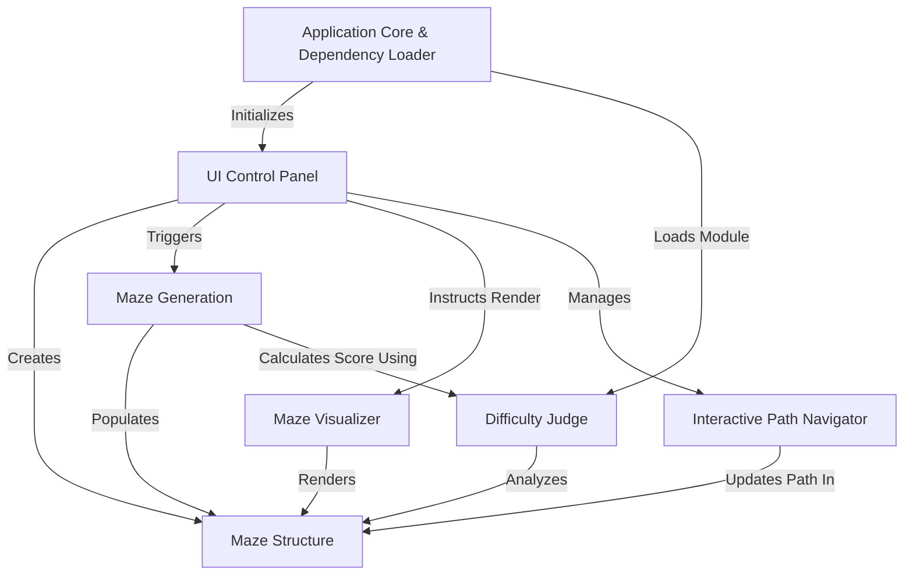

# Tutorial: mazegen

`mazegen` is a web application that allows users to **generate** customizable mazes with parameters like *width, height, cell size*, and *seed*.
It *visualizes* these mazes using a sketchy, hand-drawn style and provides an *interactive path drawing* feature for users to solve them.
The application also includes a system to analyze and display the *difficulty* of each generated maze.

**Source Repository:** [None](None)

## Chapters

1. [UI Control Panel
](01_ui_control_panel_.md)
2. [Maze Structure
](02_maze_structure_.md)
3. [Difficulty Judge
](03_difficulty_judge_.md)
4. [Maze Generation
](04_maze_generation_.md)
5. [Maze Visualizer
](05_maze_visualizer_.md)
6. [Interactive Path Navigator
](06_interactive_path_navigator_.md)
7. [Application Core & Dependency Loader
](07_application_core___dependency_loader_.md)

---

Generated by [AI Codebase Knowledge Builder](https://github.com/The-Pocket/Tutorial-Codebase-Knowledge)